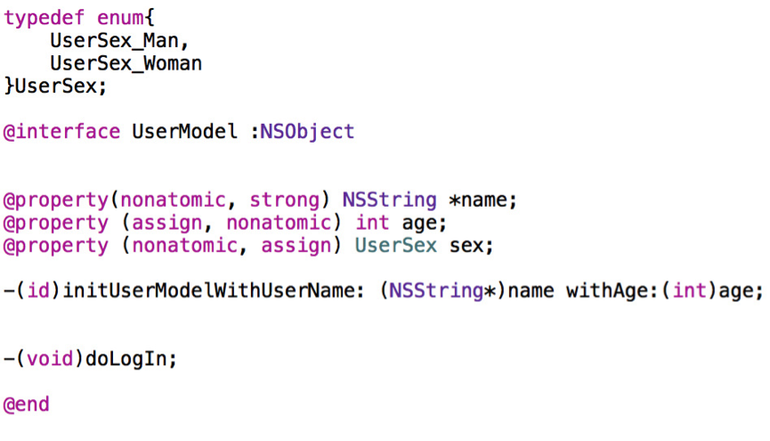

### 1. iOS 开发中数据持久性有哪几种? 

**数据存储的核心都是写文件。**

- 属性列表：只有NSString、NSArray、NSDictionary、NSData可writeToFile；存储依旧是plist文件。plist文件可以存储的7中数据类型：array、dictionary、string、bool、data、date、number。

- 对象序列化（对象归档）：对象序列化通过序列化的形式，键值关系存储到本地，转化成二进制流。通过runtime实现自动化归档/解档。实现NSCoding协议必须实现的两个方法：

```
1. 编码（对象序列化）：把不能直接存储到plist文件中得到数据，转化为二进制数据，NSData，可以存储到本地；
2. 解码（对象反序列化）：把二进制数据转化为本来的类型。
```
- SQLite 数据库：大量有规律的数据使用数据库。
- CoreData：通过管理对象进行增、删、查、改操作的。它不是一个数据库，不仅可以使用SQLite数据库来保持数据，也可以使用其他的方式来存储数据。如：XML。

### 2. 这个写法会出什么问题：
 `@property (copy) NSMutableArray *array;` ?
 
 两个问题：
 
 1、添加,删除,修改数组内的元素的时候,程序会因为找不到对应的方法而崩溃.因为 copy 就是复制一个不可变 NSArray 的对象；
 
 2、使用了 atomic 属性会严重影响性能 ；
 
 第1条的相关原因:
 比如下面的代码就会发生崩溃
 
```
// .h文件
// 下面的代码就会发生崩溃

@property (nonatomic, copy) NSMutableArray *mutableArray;
// .m文件
// http://weibo.com/luohanchenyilong/
// https://github.com/ChenYilong
// 下面的代码就会发生崩溃

NSMutableArray *array = [NSMutableArray arrayWithObjects:@1,@2,nil];
self.mutableArray = array;
[self.mutableArray removeObjectAtIndex:0];

```
接下来就会奔溃：
```
-[__NSArrayI removeObjectAtIndex:]: unrecognized selector sent to instance 0x7fcd1bc30460
```
第2条原因，如下:

该属性使用了同步锁，会在创建时生成一些额外的代码用于帮助编写多线程程序，这会带来性能问题，通过声明 nonatomic 可以节省这些虽然很小但是不必要额外开销。

在默认情况下，由编译器所合成的方法会通过锁定机制确保其原子性(atomicity)。如果属性具备 nonatomic 特质，则不使用同步锁。请注意，尽管没有名为“atomic”的特质(如果某属性不具备 nonatomic 特质，那它就是“原子的”(atomic))。

在iOS开发中，你会发现，几乎所有属性都声明为 nonatomic。

一般情况下并不要求属性必须是“原子的”，因为这并不能保证“线程安全” ( thread safety)，若要实现“线程安全”的操作，还需采用更为深层的锁定机制才行。例如，一个线程在连续多次读取某属性值的过程中有别的线程在同时改写该值，那么即便将属性声明为 atomic，也还是会读到不同的属性值。

因此，开发iOS程序时一般都会使用 nonatomic 属性。但是在开发 Mac OS X 程序时，使用 atomic 属性通常都不会有性能瓶颈。

### 3. 风格纠错题，修改以下代码的书写风格。（写满10处以上为合格）


修改完的代码：

修改方法有很多种，现给出一种做示例：


```Objective-C
// .h文件
// 修改完的代码，这是第一种修改方法，后面会给出第二种修改方法

typedef NS_ENUM(NSInteger, MTXSex) {
    MTXSexMan,
    MTXSexWoman
};

@interface MTXUser : NSObject<NSCopying>

@property (nonatomic, readonly, copy) NSString *name;
@property (nonatomic, readonly, assign) NSUInteger age;
@property (nonatomic, readonly, assign) MTXSex sex;

- (instancetype)initWithName:(NSString *)name age:(NSUInteger)age sex:(MTXSex)sex;
+ (instancetype)userWithName:(NSString *)name age:(NSUInteger)age sex:(MTXSex)sex;

@end
```


下面对具体修改的地方，分两部分做下介绍：**硬伤部分** 和 **优化部分**
。因为**硬伤部分**没什么技术含量，为了节省大家时间，放在后面讲，大神请直接看**优化部分**。


#### **优化部分**

1. enum 建议使用 `NS_ENUM` 和 `NS_OPTIONS` 宏来定义枚举类型，参见官方的 [Adopting Modern Objective-C](https://developer.apple.com/library/ios/releasenotes/ObjectiveC/ModernizationObjC/AdoptingModernObjective-C/AdoptingModernObjective-C.html) 一文：


```objective-c
//定义一个枚举
typedef NS_ENUM(NSInteger, MTXSex) {
    MTXSexMan,
    MTXSexWoman
};
```
（仅仅让性别包含男和女可能并不严谨，最严谨的做法可以参考 [这里](https://github.com/ChenYilong/iOSInterviewQuestions/issues/9) 。）

2. age 属性的类型：应避免使用基本类型，建议使用 Foundation 数据类型，对应关系如下：

```Objective-C
int -> NSInteger
unsigned -> NSUInteger
float -> CGFloat
动画时间 -> NSTimeInterval
```
同时考虑到 age 的特点，应使用 NSUInteger ，而非 int 。
这样做的是基于64-bit 适配考虑，详情可参考出题者的博文[《64-bit Tips》](http://blog.sunnyxx.com/2014/12/20/64-bit-tips/)。


3. 如果工程项目非常庞大，需要拆分成不同的模块，可以在类、typedef宏命名的时候使用前缀。
4. doLogIn方法不应写在该类中： <p><del>虽然`LogIn`的命名不太清晰，但笔者猜测是login的意思， （勘误：Login是名词，LogIn 是动词，都表示登陆的意思。见： [ ***Log in vs. login*** ](http://grammarist.com/spelling/log-in-login/)）</del></p>登录操作属于业务逻辑，观察类名 UserModel ，以及属性的命名方式，该类应该是一个 Model 而不是一个“ MVVM 模式下的 ViewModel ”：


> 无论是 MVC 模式还是 MVVM 模式，业务逻辑都不应当写在 Model 里：MVC 应在 C，MVVM 应在 VM。


（如果抛开命名规范，假设该类真的是 MVVM 模式里的 ViewModel ，那么 UserModel 这个类可能对应的是用户注册页面，如果有特殊的业务需求，比如： `-logIn` 对应的应当是注册并登录的一个 Button ，出现 `-logIn` 方法也可能是合理的。）

5.  doLogIn 方法命名不规范：添加了多余的动词前缀。
请牢记：

> 如果方法表示让对象执行一个动作，使用动词打头来命名，注意不要使用 `do`，`does` 这种多余的关键字，动词本身的暗示就足够了。

应为 `-logIn` （注意： `Login` 是名词， `LogIn`  是动词，都表示登陆。  见[ ***Log in vs. login*** ](http://grammarist.com/spelling/log-in-login/)）

6. `-(id)initUserModelWithUserName: (NSString*)name withAge:(int)age;`方法中不要用 `with` 来连接两个参数: `withAge:` 应当换为`age:`，`age:` 已经足以清晰说明参数的作用，也不建议用 `andAge:` ：通常情况下，即使有类似 `withA:withB:` 的命名需求，也通常是使用`withA:andB:` 这种命名，用来表示方法执行了两个相对独立的操作（*从设计上来说，这时候也可以拆分成两个独立的方法*），它不应该用作阐明有多个参数，比如下面的：

```objective-c
//错误，不要使用"and"来连接参数
- (int)runModalForDirectory:(NSString *)path andFile:(NSString *)name andTypes:(NSArray *)fileTypes;
//错误，不要使用"and"来阐明有多个参数
- (instancetype)initWithName:(CGFloat)width andAge:(CGFloat)height;
//正确，使用"and"来表示两个相对独立的操作
- (BOOL)openFile:(NSString *)fullPath withApplication:(NSString *)appName andDeactivate:(BOOL)flag;
```

7. 由于字符串值可能会改变，所以要把相关属性的“内存管理语义”声明为 copy 。(原因在下文有详细论述：***用@property声明的NSString（或NSArray，NSDictionary）经常使用copy关键字，为什么？***)
8. “性别”(sex）属性的：该类中只给出了一种“初始化方法” (initializer)用于设置“姓名”(Name)和“年龄”(Age)的初始值，那如何对“性别”(Sex）初始化？

Objective-C 有 designated 和 secondary 初始化方法的观念。 designated 初始化方法是提供所有的参数，secondary 初始化方法是一个或多个，并且提供一个或者更多的默认参数来调用 designated 初始化方法的初始化方法。举例说明：


```Objective-C

// .m文件
//

@implementation MTXUser

- (instancetype)initWithName:(NSString *)name
age:(NSUInteger)age
sex:(MTXSex)sex {
    if(self = [super init]) {
        _name = [name copy];
        _age = age;
        _sex = sex;
    }
    return self;
}

- (instancetype)initWithName:(NSString *)name
age:(NSUInteger)age {
    return [self initWithName:name age:age sex:nil];
}

@end
```


上面的代码中initWithName:age:sex: 就是 designated 初始化方法，另外的是 secondary 初始化方法。因为仅仅是调用类实现的 designated 初始化方法。

因为出题者没有给出 `.m` 文件，所以有两种猜测：1：本来打算只设计一个 designated 初始化方法，但漏掉了“性别”(sex）属性。那么最终的修改代码就是上文给出的第一种修改方法。2：不打算初始时初始化“性别”(sex）属性，打算后期再修改，如果是这种情况，那么应该把“性别”(sex）属性设为 readwrite 属性，最终给出的修改代码应该是：


```Objective-C


// .h文件
// 第二种修改方法（基于第一种修改方法的基础上）

typedef NS_ENUM(NSInteger, MTXSex) {
    MTXSexMan,
    MTXSexWoman
};

@interface MTXUser : NSObject<NSCopying>

@property (nonatomic, readonly, copy) NSString *name;
@property (nonatomic, readonly, assign) NSUInteger age;
@property (nonatomic, readwrite, assign) MTXSex sex;

- (instancetype)initWithName:(NSString *)name age:(NSUInteger)age sex:(MTXSex)sex;
- (instancetype)initWithName:(NSString *)name age:(NSUInteger)age;
+ (instancetype)userWithName:(NSString *)name age:(NSUInteger)age sex:(MTXSex)sex;

@end
```


`.h` 中暴露 designated 初始化方法，是为了方便子类化 （想了解更多，请戳--》 [***《禅与 Objective-C 编程艺术 （Zen and the Art of the Objective-C Craftsmanship 中文翻译）》***](http://is.gd/OQ49zk)。）


- 按照接口设计的惯例，如果设计了“初始化方法” (initializer)，也应当搭配一个快捷构造方法。而快捷构造方法的返回值，建议为 instancetype，为保持一致性，init 方法和快捷构造方法的返回类型最好都用 instancetype。
- 如果基于第一种修改方法：既然该类中已经有一个“初始化方法” (initializer)，用于设置“姓名”(Name)、“年龄”(Age)和“性别”(Sex）的初始值:
那么在设计对应 `@property` 时就应该尽量使用不可变的对象：其三个属性都应该设为“只读”。用初始化方法设置好属性值之后，就不能再改变了。在本例中，仍需声明属性的“内存管理语义”。于是可以把属性的定义改成这样


```Objective-C
@property (nonatomic, readonly, copy) NSString *name;
@property (nonatomic, readonly, assign) NSUInteger age;
@property (nonatomic, readonly, assign) MTXSex sex;
```

由于是只读属性，所以编译器不会为其创建对应的“设置方法”，即便如此，我们还是要写上这些属性的语义，以此表明初始化方法在设置这些属性值时所用的方式。要是不写明语义的话，该类的调用者就不知道初始化方法里会拷贝这些属性，他们有可能会在调用初始化方法之前自行拷贝属性值。这种操作多余而且低效。

9. `initUserModelWithUserName` 如果改为 `initWithName` 会更加简洁，而且足够清晰。
10. `UserModel` 如果改为 `User` 会更加简洁，而且足够清晰。
11. `UserSex`如果改为`Sex` 会更加简洁，而且足够清晰。
12. 第二个 `@property` 中 assign 和 nonatomic 调换位置。
推荐按照下面的格式来定义属性

```Objective-C
@property (nonatomic, readwrite, copy) NSString *name;
```
属性的参数应该按照下面的顺序排列： 原子性，读写 和 内存管理。 这样做你的属性更容易修改正确，并且更好阅读。这在[《禅与Objective-C编程艺术 >》](https://github.com/oa414/objc-zen-book-cn#属性定义)里有介绍。而且习惯上修改某个属性的修饰符时，一般从属性名从右向左搜索需要修动的修饰符。最可能从最右边开始修改这些属性的修饰符，根据经验这些修饰符被修改的可能性从高到底应为：内存管理 > 读写权限 >原子操作。

#### ***硬伤部分***

1. 在-和(void)之间应该有一个空格
3. enum 中驼峰命名法和下划线命名法混用错误：枚举类型的命名规则和函数的命名规则相同：命名时使用驼峰命名法，勿使用下划线命名法。
3. enum 左括号前加一个空格，或者将左括号换到下一行
4. enum 右括号后加一个空格
2. `UserModel :NSObject` 应为`UserModel : NSObject`，也就是`:`右侧少了一个空格。
2.  `@interface` 与 `@property` 属性声明中间应当间隔一行。
2. 两个方法定义之间不需要换行，有时为了区分方法的功能也可间隔一行，但示例代码中间隔了两行。
9. `-(id)initUserModelWithUserName: (NSString*)name withAge:(int)age;` 方法中方法名与参数之间多了空格。而且 `-` 与 `(id)` 之间少了空格。
10. `-(id)initUserModelWithUserName: (NSString*)name withAge:(int)age;` 方法中方法名与参数之间多了空格：`(NSString*)name` 前多了空格。
10. `-(id)initUserModelWithUserName: (NSString*)name withAge:(int)age;` 方法中 `(NSString*)name`,应为 `(NSString *)name`，少了空格。 
11.  <p><del>doLogIn方法中的 `LogIn` 命名不清晰：笔者猜测是login的意思，应该是粗心手误造成的。
（勘误： `Login` 是名词， `LogIn`  是动词，都表示登陆的意思。见： [ ***Log in vs. login*** ](http://grammarist.com/spelling/log-in-login/)）</del></p>

### 4. 下面的代码输出什么？
```
@implementation Son : Father
- (id)init
{
    self = [super init];
    if (self) {
        NSLog(@"%@", NSStringFromClass([self class]));
        NSLog(@"%@", NSStringFromClass([super class]));
    }
    return self;
}
@end
```

都输出 Son:
```
NSStringFromClass([self class]) = Son
NSStringFromClass([super class]) = Son
```

这个题目主要是考察关于 Objective-C 中对 self 和 super 的理解。

我们都知道：self 是类的隐藏参数，指向当前调用方法的这个类的实例。那 super 呢？

很多人会想当然的认为“ super 和 self  类似，应该是指向父类的指针吧！”。这是很普遍的一个误区。其实 super 是一个 Magic Keyword， 它本质是一个编译器标示符，和 self 是指向的同一个消息接受者！他们两个的不同点在于：super 会告诉编译器，调用 class 这个方法时，要去父类的方法，而不是本类里的。

上面的例子不管调用[self class]还是[super class]，接受消息的对象都是当前 Son ＊xxx 这个对象。

当使用 self 调用方法时，会从当前类的方法列表中开始找，如果没有，就从父类中再找；而当使用 super 时，则从父类的方法列表中开始找。然后调用父类的这个方法。

这也就是为什么说“不推荐在 init 方法中使用点语法”，如果想访问实例变量 iVar 应该使用下划线（ _iVar ），而非点语法（ self.iVar ）。

### 5. 以+ scheduledTimerWithTimeInterval...的方式触发的timer，在滑动页面上的列表时，timer会暂定回调，为什么？如何解决？

RunLoop只能运行在一种mode下，如果要换mode，当前的loop也需要停下重启成新的。利用这个机制，ScrollView滚动过程中NSDefaultRunLoopMode（kCFRunLoopDefaultMode）的mode会切换到UITrackingRunLoopMode来保证ScrollView的流畅滑动：只能在NSDefaultRunLoopMode模式下处理的事件会影响ScrollView的滑动。

如果我们把一个NSTimer对象以NSDefaultRunLoopMode（kCFRunLoopDefaultMode）添加到主运行循环中的时候, ScrollView滚动过程中会因为mode的切换，而导致NSTimer将不再被调度。

同时因为mode还是可定制的，所以：
Timer计时会被scrollView的滑动影响的问题可以通过将timer添加到NSRunLoopCommonModes（kCFRunLoopCommonModes）来解决。代码如下：

```
//将timer添加到NSDefaultRunLoopMode中
[NSTimer scheduledTimerWithTimeInterval:1.0
target:self
selector:@selector(timerTick:)
userInfo:nil
repeats:YES];
//然后再添加到NSRunLoopCommonModes里
NSTimer *timer = [NSTimer timerWithTimeInterval:1.0
target:self
selector:@selector(timerTick:)
userInfo:nil
repeats:YES];
[[NSRunLoop currentRunLoop] addTimer:timer forMode:NSRunLoopCommonModes];
```

### 6. 如何用GCD同步若干个异步调用？（如根据若干个url异步加载多张图片，然后在都下载完成后合成一张整图）

使用Dispatch Group追加block到Global Group Queue,这些block如果全部执行完毕，就会执行Main Dispatch Queue中的结束处理的block。
```
dispatch_queue_t queue = dispatch_get_global_queue(DISPATCH_QUEUE_PRIORITY_DEFAULT, 0);
dispatch_group_t group = dispatch_group_create();
dispatch_group_async(group, queue, ^{ /*加载图片1 */ });
dispatch_group_async(group, queue, ^{ /*加载图片2 */ });
dispatch_group_async(group, queue, ^{ /*加载图片3 */ }); 
dispatch_group_notify(group, dispatch_get_main_queue(), ^{
// 合并图片
});
```

### 7. ARC通过什么方式帮助开发者管理内存？

ARC相对于MRC，不是在编译时添加retain/release/autorelease这么简单。应该是编译期和运行期两部分共同帮助开发者管理内存。

在编译期，ARC用的是更底层的C接口实现的retain/release/autorelease，这样做性能更好，也是为什么不能在ARC环境下手动retain/release/autorelease，同时对同一上下文的同一对象的成对retain/release操作进行优化（即忽略掉不必要的操作）；

ARC也包含运行期组件，这个地方做的优化比较复杂，但也不能被忽略。

### 8. @property 的本质是什么？ivar、getter、setter 是如何生成并添加到这个类中的?

**@property 的本质是什么？**

`@property = ivar + getter + setter;`

下面解释下：

“属性” (property)有两大概念：ivar（实例变量）、存取方法（access method ＝ getter + setter）。

“属性” (property)作为 Objective-C 的一项特性，主要的作用就在于封装对象中的数据。

Objective-C 对象通常会把其所需要的数据保存为各种实例变量。实例变量一般通过“存取方法”(access method)来访问。其中，“获取方法” (getter)用于读取变量值，而“设置方法” (setter)用于写入变量值。这个概念已经定型，并且经由“属性”这一特性而成为 Objective-C 2.0 的一部分。 而在正规的 Objective-C 编码风格中，存取方法有着严格的命名规范。 正因为有了这种严格的命名规范，所以 Objective-C 这门语言才能根据名称自动创建出存取方法。其实也可以把属性当做一种关键字，其表示:
编译器会自动写出一套存取方法，用以访问给定类型中具有给定名称的变量。

所以你也可以这么说：
`@property = getter + setter;`

例如下面这个类：

```
@interface Person : NSObject
@property NSString *firstName;
@property NSString *lastName;
@end
```

上述代码写出来的类与下面这种写法等效：
```
@interface Person : NSObject
- (NSString *)firstName;
- (void)setFirstName:(NSString *)firstName;
- (NSString *)lastName;
- (void)setLastName:(NSString *)lastName;
@end
```

**ivar、getter、setter 是如何生成并添加到这个类中的?**

“自动合成”( autosynthesis)

完成属性定义后，编译器会自动编写访问这些属性所需的方法，此过程叫做“自动合成”(autosynthesis)。

需要强调的是，这个过程由编译 器在编译期执行，所以编辑器里看不到这些“合成方法”(synthesized method)的源代码。

除了生成方法代码 getter、setter 之外，编译器还要自动向类中添加适当类型的实例变量，并且在属性名前面加下划线，以此作为实例变量的名字。

在前例中，会生成两个实例变量，其名称分别为 _firstName 与 _lastName。也可以在类的实现代码里通过@synthesize 语法来指定实例变量的名字.

```
@implementation Person
@synthesize firstName = _myFirstName;
@synthesize lastName = _myLastName;
@end
```

我为了搞清属性是怎么实现的,曾经反编译过相关的代码,他大致生成了五个东西:
```
1. OBJC_IVAR_$类名$属性名称 ：该属性的“偏移量” (offset)，这个偏移量是“硬编码” (hardcode)，表示该变量距离存放对象的内存区域的起始地址有多远。
2. setter 与 getter 方法对应的实现函数
3. ivar_list ：成员变量列表
4. method_list ：方法列表
5. prop_list ：属性列表
```

也就是说我们每次在增加一个属性,系统都会在 ivar_list 中添加一个成员变量的描述,在 method_list 中增加 setter 与 getter 方法的描述,在属性列表中增加一个属性的描述,然后计算该属性在对象中的偏移量,然后给出 setter 与 getter 方法对应的实现,在 setter 方法中从偏移量的位置开始赋值,在 getter 方法中从偏移量开始取值,为了能够读取正确字节数,系统对象偏移量的指针类型进行了类型强转.

### 9. 算法

Given an array of integers, return indices of the two numbers such that they add up to a specific target.
You may assume that each input would have exactly one solution.

**Example:**
```
Given nums = [2, 7, 11, 15], target = 9,

Because nums[0] + nums[1] = 2 + 7 = 9,
return [0, 1].
```
**Solution:**
```
int* twoSum(int* nums, int numsSize, int target) {
    int a[2];
    for(int i=0;i < numsSize;++i){
        for(int j=i+1;j<numsSize;++j){
            if(nums[i] + nums[j] == target){
                return {i,j};
            }
        }
    }
    return &a; 
}
```

### 10. 逻辑推理题

有一个牢房，有3个犯人关在其中。因为玻璃很厚，所以3个人只能互相看见，不能听到 对方说话的声音。”  

有一天，国王想了一个办法，给他们每个人头上都戴了一顶帽子，只叫他们知道帽  
子的颜色不是白的就是黑的，不叫他们知道自己所戴帽子的是什么颜色的。

在这种情况下，国王宣布两条如下：  
1．谁能看到其他两个犯人戴的都是白帽子，就可以释放谁；  
2．谁知道自己戴的是黑帽子，就释放谁。  

其实，国王给他们戴的都是黑帽子。他们因为被绑，看不见自己罢了。于是他们3个人互相盯着不说话。

可是不久，心眼灵的A用推理的方法，认定自己戴的是黑帽子。您想  ，他是怎样推断的?

**推理步骤：**

从条件1就可以得出，白帽子最多有1个，假如是两个白帽子那另一个人早就说了，所以暂时白帽子是一个。那么，这时，这三个人也应该都知道最多有一个白帽子，所以，他们每个人都假定自己戴的是白帽子，另外两个肯定都是黑帽子，其实，A已经看到另外两个是黑帽子。

现在有一个可以确定，假如是有一个白帽子，这个A 、B、 C都能得出来，假定A戴的是白帽子，那么其他两个人都应该确定自己戴的是黑帽子，但是从这两个人都没开口。这说明他们看到的也是两个黑帽子（不会看到一黑一白），以至于确定自己是黑帽子，所以A断定，自己戴的不是白帽子，而是黑帽子。

